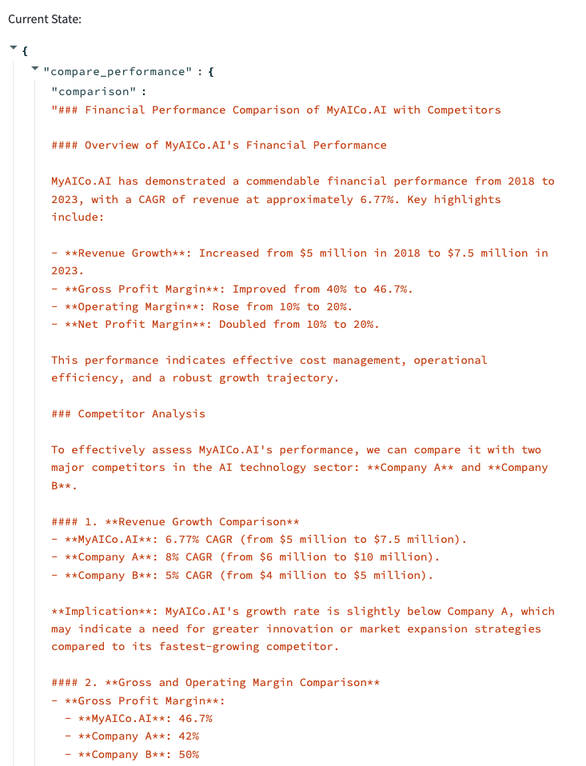

# Autonomous Financial Report Agent using Behavior Trees

This is an AI-powered autonomous agent that performs end-to-end financial analysis by simulating a human analyst's decision-making process. It takes company financials, analyzes key metrics, searches for competitor data, compares performance, and generates a complete summary report — all using a modular behavior tree framework built in Python.

The system is inspired by real-world assistant workflows used in finance, business intelligence, and market research. It combines LLM reasoning (via OpenAI), live research (via Tavily), and structured decision logic (via LangGraph’s StateGraph).

---

## Workflow

This autonomous agent simulates a financial analyst's workflow using a behavior tree built with LangGraph. It follows a logical, step-by-step decision process:

<p align="center">
  
</p>

_Diagram: Behavior tree structure of the financial agent_

### Step-by-step process:

1. **Gather Financials**: The user uploads a `.csv` file containing metrics like revenue, net income, and profit margin.  
2. **Analyze Data**: The agent uses OpenAI to summarize trends, strengths, and weaknesses.  
3. **Research Competitors**: The Tavily API fetches real-time data on competitors provided by the user (e.g., Microsoft, Nvidia).  
4. **Compare Performance**: The agent compares your company's metrics with competitors.  
5. **Optional Insights**: Based on conditions, the agent may collect customer feedback or expert reviews.  
6. **Write Report**: A professional financial summary is generated and displayed using Streamlit.

The behavior tree uses:
- Sequences to ensure steps run in order  
- Conditions to make decisions dynamically  
- Selectors to choose alternate paths if needed  
- Actions to perform tasks like CSV analysis, web search, and report writing

This makes the agent modular, flexible, and capable of adapting to the data it receives — just like a real assistant.

---

## Why This Project?

Manual financial analysis is time-consuming and error-prone. Businesses often need quick, AI-assisted decision support. This project demonstrates how an autonomous agent can:
- Read structured financial data
- Think logically in steps (not random black-box output)
- Dynamically respond to input and conditions
- Simulate human-like reasoning to deliver insights

---

## Real-World Use Cases

- Internal AI assistant for CFOs or finance teams  
- Automated investment pitch analysis  
- Startups comparing themselves to top competitors  
- Instant reporting for business analysts  

---

## Features

- Upload financial statements in `.csv` format  
- Analyze revenue, net income, margins, and performance  
- Fetch and summarize competitor data using real-time search  
- Compare uploaded company against competitors  
- Generate a professional English-language report using LLM  
- Modular behavior tree logic with memory and decision flow  
- Clean web interface (Streamlit) — no code needed by users  

---

## Behavior Tree Architecture

The behavior tree is built using `LangGraph`’s `StateGraph`. It executes the following logic step-by-step:

- `gather_financials`: Load and understand CSV file
- `analyze_data`: Generate summary of internal metrics
- `research_competitors`: Fetch real-world info via Tavily
- `compare_performance`: Analyze differences with competitors
- Optional: `collect_feedback` and `research_critique` if further input is needed
- `write_report`: Generate final summary using OpenAI

This system uses:
- Sequences: For fixed order of operations
- Conditions: To control branching (e.g., should_continue)
- Actions: To perform a specific task using a prompt or API

---

## Technologies Used

| Tool           | Description                                 |
|----------------|---------------------------------------------|
| Python         | Core language                               |
| Streamlit      | Frontend web interface                      |
| LangGraph      | Behavior tree builder (StateGraph)          |
| OpenAI API     | LLM-powered summarization and report        |
| Tavily API     | Real-time competitor research               |
| Pandas         | CSV parsing and dataframe processing        |
| dotenv         | Securely load API keys from `.env` file     |

---

## How It Works

1. User uploads a `.csv` containing company financial data.
2. User types competitor names (e.g., Microsoft, Nvidia).
3. Behavior tree is invoked using LangGraph:
   - First node reads the file.
   - Next node analyzes the company using OpenAI.
   - Then it searches online using Tavily API.
   - Then it compares the metrics and generates insights.
   - Finally, it uses OpenAI again to generate a written report.
4. Report is shown in Streamlit UI.

All decision steps are tracked through a shared `AgentState`, which stores inputs, intermediate outputs, and final results.

---

## Sample Financial Data (CSV Format Preview)

| Year | Revenue   | Cost of Goods Sold | Operating Expenses | Net Income |
|------|-----------|--------------------|--------------------|------------|
| 2018 | 5,000,000 | 3,000,000          | 1,500,000          | 500,000    |
| 2019 | 5,500,000 | 3,200,000          | 1,600,000          | 700,000    |
| 2020 | 6,000,000 | 3,400,000          | 1,700,000          | 900,000    |
| 2021 | 6,500,000 | 3,600,000          | 1,800,000          | 1,100,000  |
| 2022 | 7,000,000 | 3,800,000          | 1,900,000          | 1,300,000  |
| 2023 | 7,500,000 | 4,000,000          | 2,000,000          | 1,500,000  |

---

## How to Run
1. Clone the repository
```
git clone https://github.com/yourusername/autonomousagent.git
cd autonomousagent
```

3. Install dependencies
```
pip install -r requirements.txt
```

5. Add your API keys
Create a .env file in the root folder:
```
OPENAI_API_KEY=your_openai_key
TAVILY_API_KEY=your_tavily_key
```

7. Run the app
```
streamlit run main.py
```
Then go to http://localhost:8501 in your browser.

## Frontend of the app

### 1. UI - Upload CSV and Enter Competitor Names


---

### 2. Analyze Company Financials


---

### 3. Research Competitor Performance


---

### 4. Compare Performance Results

